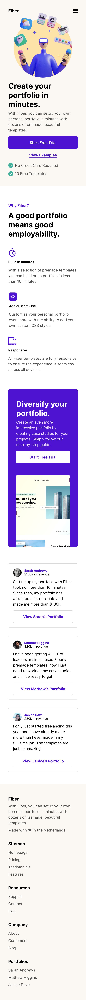
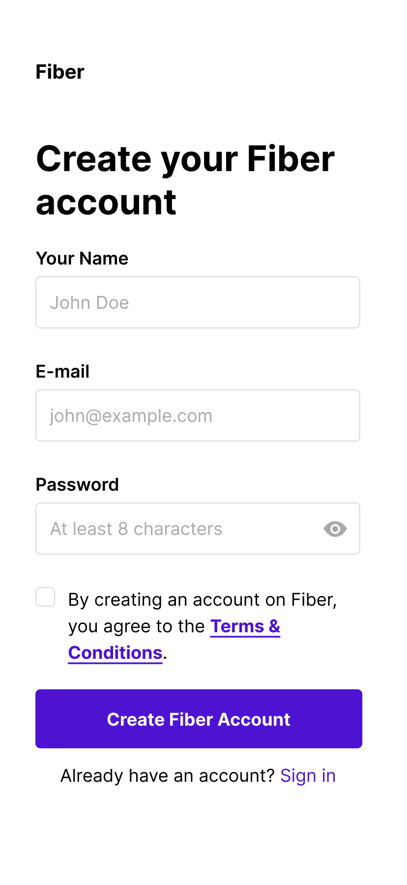

# Fiber Starter Landing Page

This is a challenge by Codewell.cc a platform that aims to provide real-world design templates to practice HTML and CSS projects

See Website Live: [See Live](https://lahmar.me/fiber-starter/)

Design to be developed:

## Landing Page (index.html):

- Desktop:

- Mobile:

## Sign Up Page (signup.html):

- Desktop:

- Mobile:

Happy Coding!